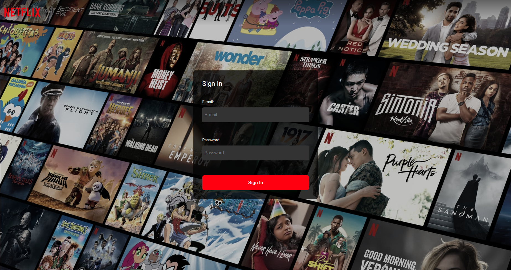
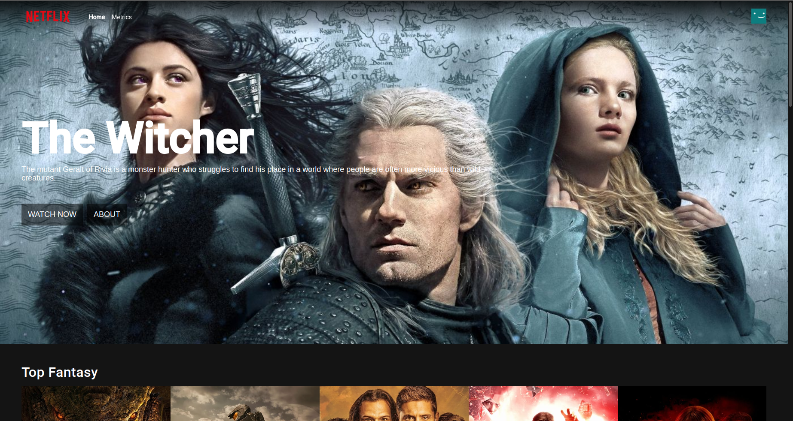
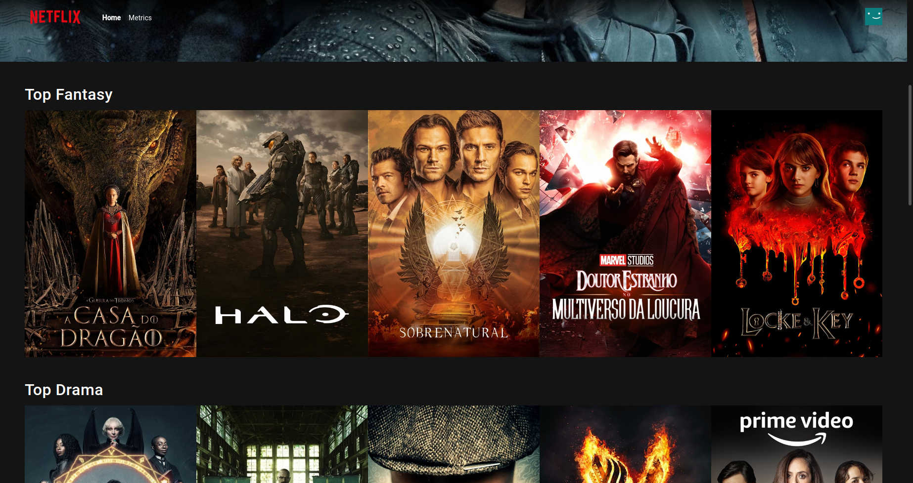
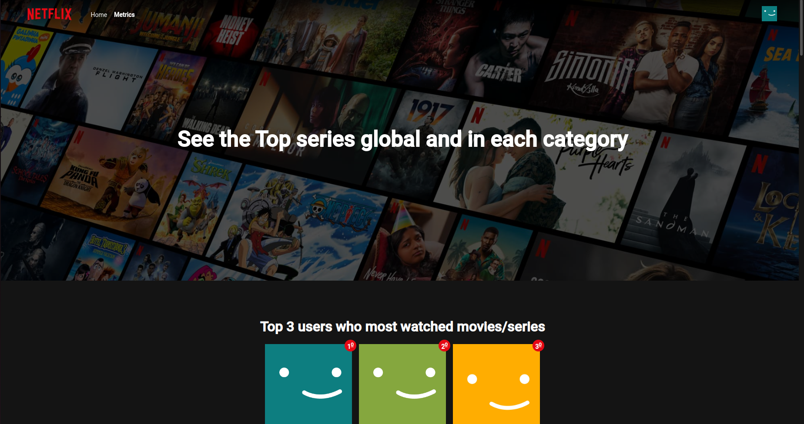
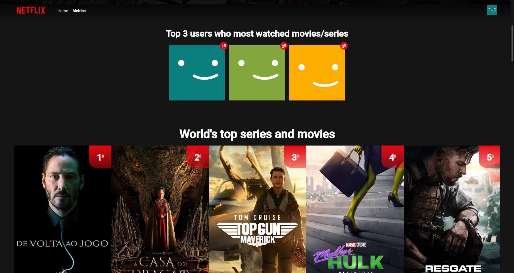
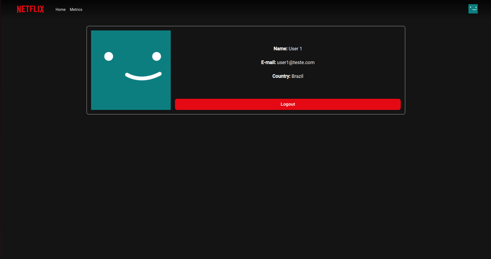
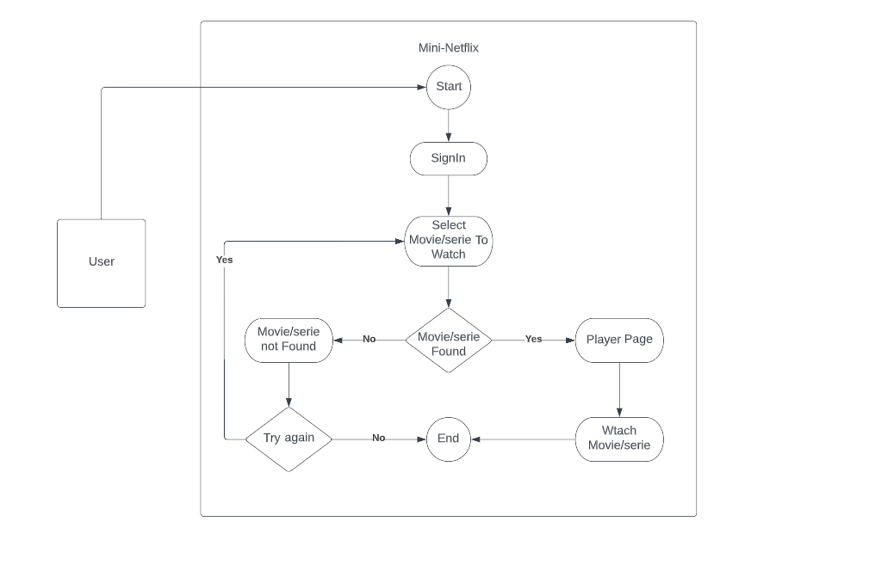

# Mini-Netflix

This application is a mini version of the so great Netflix. With this application you can access with different users and see the actions of each of them influence the application, the actions of each user have an effect on the entire application and can be seen by everyone

You will have movies and series separated by categories, metrics of most watched movies/series in each country, in each category and also the top 3 users who watch movies the most :D.

You also have access to a user page, where you can view some user information and log out to change user if you wish.


# See some screenshots of the application:

## SignIn Page:


## Home Page:

</br>
</br>
</br>



## Metrics Page:

</br>
</br>
</br>


## User profile Page:

</br>
</br>
</br>

# UML - Activity Diagram:


# User test Mocks:

To access the application you will have to login with one of these mocked user credentials:

 ### User 1 (Brazil):

```bash
  E-mail: 'user1@teste.com'
  Password: 'teste1'
```

 ### User 2 (USA):

```bash
  E-mail: 'user2@teste.com'
  Password: 'teste2'
```

 ### User 3 (Argentina):

```bash
  E-mail: 'user3@teste.com'
  Password: 'teste3'
```

OBS: With these credentials you can freely access the application and switch users whenever you want. Any credentials other than these will not work.

# How to access this application?

You can access this application from any browser through the link https://mini-netflix-liard.vercel.app/, access the application and have fun :D.


# How to start the project:

After cloning this project on your machine, you will need to install the project's dependencies. You can do this by going to the project root and running the commands in your terminal:

```bash

If you use npm
$ npm install

If you use yarn
$ yarn

```

## After installing the dependencies:

After installing the project's dependencies, you can run it on your machine.

- To run this project locally in developer mode you can run the command:

```bash

If you use npm
$ npm run dev

If you use yarn
$ yarn dev

```

- If you have Docker installed on your machine you can run this project with docker compose. To run docker compose run the command:

```bash

If you use npm
$ npm run compose

If you use yarn
$ yarn compose

```
OBS: To access your application, access http://localhost:4200 in your preferred browser.

# Running tests

This application has automated tests to help maintain the software quality. Unit and End-2-End testing approaches were used.

- To view the unit tests just run the command `npm run test` or `yarn test` in your terminal. 
- If you want to analyze the code-coverage you can run the command `npm run test-coverage` or `yarn test-coverage`. 
After executing the command a coverage folder will be created in the project root, where you can get more details about it.
- To run the End-to-End tests you must run the command `npm run e2e` or `yarn e2e`, after executing the command a screen with Cypress will be opened so that you can run the tests.
